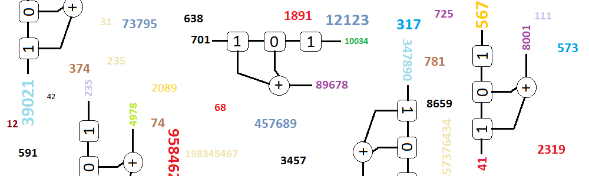

# 64-bit xorshift random number generator functions (in x86 assembly language)

Implementation of 64-bit xorshift random number generator discovered by
George Marsaglia and described in his paper [Xorshift RNGs](http://www.jstatsoft.org/v08/i14/paper).

For 64-bit xorshift RNGs George Marsaglia proposed 275 triples, which are
used here in 275 assembly functions.

The assembly file has been originally generated using my [cppasm](https://github.com/aelfimow/cppasm)
generator.
